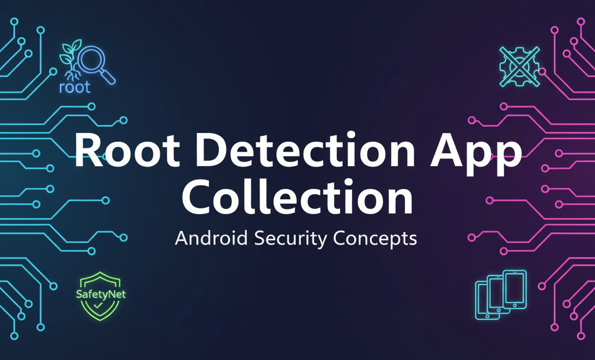

  

# 📱 Collection of Root Detection & Security Check Apps for Android

This repository contains a curated list of applications useful for detecting **Root / Xposed / Custom ROM / Bootloader Unlock / SafetyNet / Play Integrity** status on Android devices.  

---

## 📑 Table of Contents
- [Root / XPosed / ROM / Bootloader / SafetyNet / Play Integrity](#-root--xposed--rom--bootloader--safetynet--play-integrity)
- [Banking Apps (Detection Examples)](#-banking-apps-detection-examples)
- [Miscellaneous Tools](#-miscellaneous-tools)
- [Credits](#-credits)
- [Notes](#-notes)

---

## 🔑 Root / XPosed / ROM / Bootloader / SafetyNet / Play Integrity
- [Android Key Attestation Sample App](https://github.com/vvb2060/KeyAttestation/releases) (Bootloader)
- [Checker](https://github.com/AkaneTan/Checker/releases) (ROM)
- [Hunter](https://github.com/unique-error/root-detection-app-collection/blob/main/Hunter_5.5.0.apk) (Root, ROM)  
  
- [Memory Detector](https://github.com/unique-error/root-detection-app-collection/blob/main/MemoryDetector_2.1.0.apk) (Root)  
  
- [Momo](https://t.me/magiskalpha/529) (Root, ROM)
- [Native Detector](https://t.me/reveny1)
- [Native Test](https://t.me/nullptr_dev) (Search on Channel)
- [Ruru](https://github.com/byxiaorun/Ruru/releases) (Root, XPosed)
- [Securify](https://github.com/RabahX/Securify/) (Root)
- [TB Checker](https://play.google.com/store/apps/details?id=krypton.tbsafetychecker) (Root, XPosed, Play Integrity, SafetyNet)

---

## 🏦 Banking Apps (Detection Examples)
- [Blind](https://play.google.com/store/apps/details?id=com.teamblind.blind)
- [BPI](https://play.google.com/store/apps/details?id=com.bpi.ng.app)
- [Livin' by Mandiri](https://play.google.com/store/apps/details?id=id.bmri.livin)
- [Kuwait Mobile ID](https://play.google.com/store/apps/details?id=kw.gov.paci.PACIMobileID)
- [Starling Bank](https://play.google.com/store/apps/details?id=com.starlingbank.android)
- [Singpass](https://play.google.com/store/apps/details?id=sg.ndi.sp)
- [Yono by SBI](https://play.google.com/store/apps/details?id=com.sbi.lotusintouch)
- [Zain Cash](https://play.google.com/store/apps/details?id=mobi.foo.zaincash)

---

## 🛠 Miscellaneous Tools
- [DRM Info](https://play.google.com/store/apps/details?id=com.androidfung.drminfo)
- [DrHowdyDoo](https://play.google.com/store/apps/developer?id=DrHowdyDoo)
- [M-Kavach 2](https://play.google.com/store/apps/details?id=org.cdac.updatemkavach)
- [Smali Detector](https://play.google.com/store/apps/details?id=com.godevelopers.SmaliDetector)
- [Xposed Detector](https://play.google.com/store/apps/details?id=com.godevelopers.XposedChecker)

---

## 🙌 Credits
Special thanks to the original developers and contributors of the listed apps:

- **vvb2060** → [Android Key Attestation Sample App](https://github.com/vvb2060/KeyAttestation/releases)
- **AkaneTan** → [Checker](https://github.com/AkaneTan/Checker/releases)
- **rushiranpise** → [Hunter](https://github.com/rushiranpise/detection), [Memory Detector](https://github.com/rushiranpise/detection)
- **Magisk Alpha Team** → [Momo](https://t.me/magiskalpha/529)
- **xiaorun** → [Ruru](https://github.com/byxiaorun/Ruru/releases)
- **RabahX** → [Securify](https://github.com/RabahX/Securify/)
- **krypton** → [TB Checker](https://play.google.com/store/apps/details?id=krypton.tbsafetychecker)
- **AndroidFung** → [DRM Info](https://play.google.com/store/apps/details?id=com.androidfung.drminfo)
- **DrHowdyDoo** → [DrHowdyDoo](https://play.google.com/store/apps/developer?id=DrHowdyDoo)
- **CDAC** → [M-Kavach 2](https://play.google.com/store/apps/details?id=org.cdac.updatemkavach)
- **GoDevelopers** → [Smali Detector](https://play.google.com/store/apps/details?id=com.godevelopers.SmaliDetector), [Xposed Detector](https://play.google.com/store/apps/details?id=com.godevelopers.XposedChecker)

Without their projects, this collection wouldn’t exist 🙏  

---

## 📌 Notes
- `Hunter.apk` and `MemoryDetector.apk` are directly hosted in this repository with versioned filenames.  
- Use these apps **only for testing and educational purposes.**  
- Banking apps listed here are for **detection reference only.**  

---

👨‍💻 Maintained by **Unique-error**
